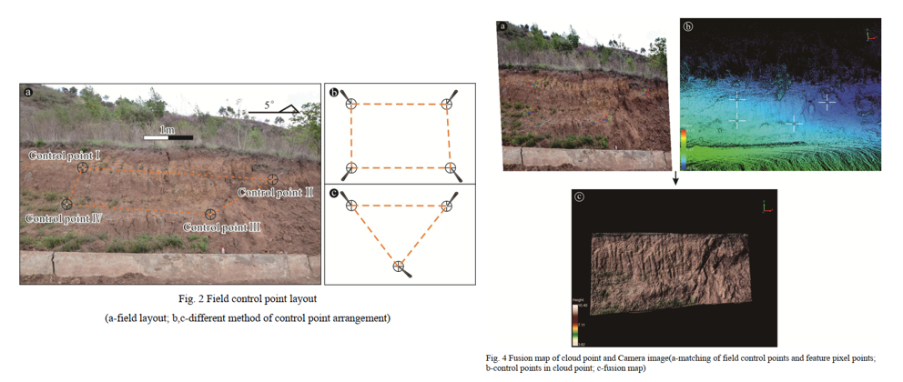

As the traditional geological cross section measurement, the artificial traverse method was recently substituted by using point coordinates data. However, it is still the crux of the matter that how to acquire the high-precision point coordinates data quickly and economically. Thereby, the backpack Lidar is presented on the premise of the principle of using point coordinates in this issue. Undoubtedly, Lidar technique, one of booming and international active remote sensing techniques, is a powerful tool in obtaining precise topographic information, high-precision 3-D coordinates and building a real 3-D model. With field practice and date processing indoors, it is essentially accomplished that geological sections maps could be generated simply, accurately and automatically in the support of relevant software such as ArcGIS and LiDAR360.

