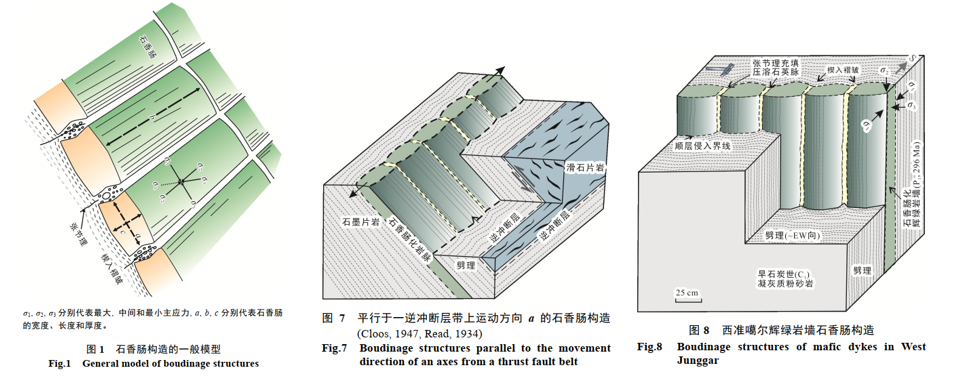

The relationship between boudinage structures and tectonic background has not yet thoroughly reviewed. Distinguishing the tectonic backgrounds of boudinage structures is helpful to decipher the tectonic evolution. There are five types of background for boudinage in term of the MEST Law of structure deformation: 1) contraction structure settings, where boudinages mainly develop in the limbs of buckle fold; 2) extensional structure settings, where boudinages mainly occur in fold hinge zone of bending; 3) gravity tectonic or vibrating ground motion settings, where boudinages mainly develop in flat strata; 4) contraction settings following extension, where boudinages mainly develop in steep-dipping dike (vein) and its wall rock ; 5) strike-slip settings, where boudinages mainly occur in shear zone, block of boudinages are usually limited by shear slip. The diverse tectonic backgrounds suggest that structure styles that host the boudinages are extremely important in the interpretation of regional tectonic stress field on basis of outcrop-scale boudinage structures.

