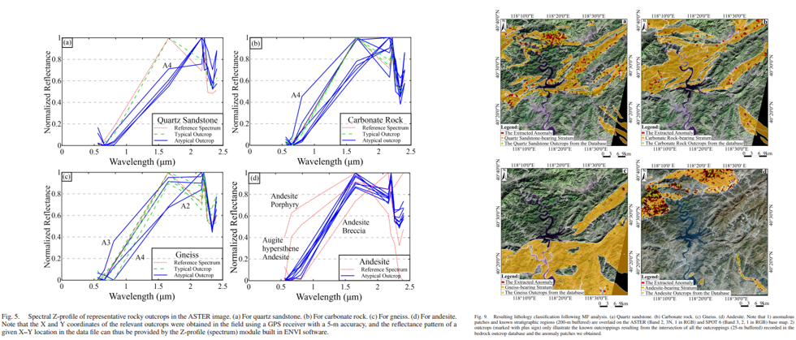

This paper studied the applicability of Advanced Spaceborne Thermal Emission and Reflection Radiometer (ASTER) data for lithological classification in the shallowly covered Eastern Yanshan Mountain of Eastern China. The interpreted objects include quartz sandstone, carbonate rock, gneiss, and andesite. An integrated approach was employed to process the remote sensing data: First, the matched filtering method, accompanied by the ASTER library and imagery spectra as reference, was used to enhance the targeted information, namely the remotely visible (typical) rock outcrops. As the andesite is frequently weathered to iron-rich minerals in the field, so the high-resolution SPOT6 3/1 image, instead of the ASTER image, was used to locate the outcrops. Second, the fractal digital number-frequency algorithm was developed to preliminarily extract the lithology anomaly patches; and the obtained geological anomalies were generalized into three types: anomalies related to outcrops, anomalies caused by different forms of the same lithology, and random noise. Third, digital elevation model derived slope masks, in combination with the spatial intersection operation, was used to eliminate the pseudo-outcrop anomalies and noise. Finally, the accuracy assessment was conducted by referencing the local rock-outcrop database, and the misclassification rates for quartz sandstone, carbonate rock, gneiss, and andesite are 8.9%, 12.5%, 23%, and 48.3%, respectively. This study has contributed a useful case study for remote-sensing lithology mapping in shallowly covered areas, and the proposed method should have a great potential to be applied to many similar cases.

