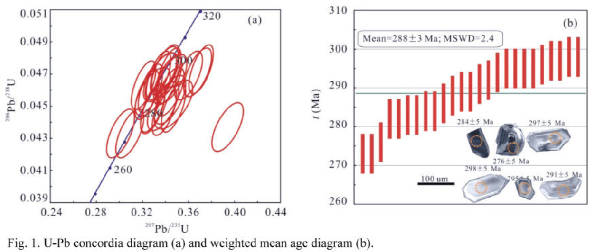

Whether the Early Permian successions are still preserved in the Olongbluk Block is controversial, which is resulted from the diverse understanding on the formation age of fossil assemblages from the lower Zhabusagaxiu Formation.

