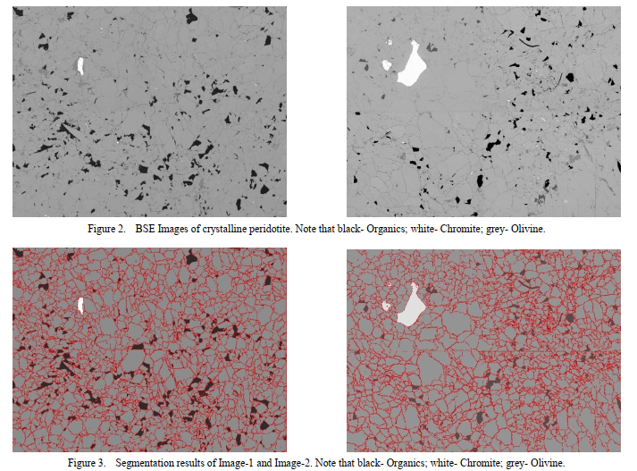

Identification of minerals in thin sections using intelligent methods is a very complex and challenging task, which mineralogists and computer scientists are faced with. In order to effectively calculate the the mineral assemblages and oxide percentage of crystalline rock, we proposed an integrated approach based on object-based image analysis (OBIA) and electron probe microscopic analyzer (EPMA). This approach contains the following steps: 1) acquisition of mineral chemistry data and back-scattered electron (BSE) images; 2) image segmentation and classification; 3) calculating the oxide percentage based on the proportional relationship. It is worth noting that the optimal scale parameter for image segmentation is essential for subsequent image classification, which also defines the proportional relationship for calculating the oxide percentage. The experimental results show that the novel method has characteristics of simple extraction approach, little extraction parameter, easy implementation and accurate recognition ratio.

