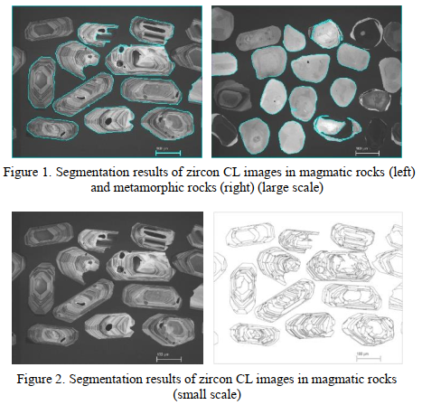

The digital image processing method is introduced into the zircon Cathodoluminescence (CL) images, and method extracting the zircon CL image particle feature information on multi-scale segmentation is proposed. We choose the magmatic and metamorphic zircon CL images as basic samples image segmentation and counting the morphological parameters, including their sizes, perimeters, axis lengths, ratios and shape indexes. Among these parameters: the magmatic zircon aspect ratio is mostly concentrated in 1.3-2.5, the average ratio is 1.83, the metamorphic zircon aspect ratio is concentrated in 1.0-1.5, the average ratio is 1.28; The zircon has a ring density average ratio of 0.097, the zircon has a ring density average ratio of 0.045. These diagnostic parameters have allowed us to discriminate the magmatic and metamorphic zircons, furtherly to distinguish zircons from basic rocks and those from acid rocks respectively. This method of morphological feature extraction quantitative analysis contributes to the geologic understanding of zircon CL images.

