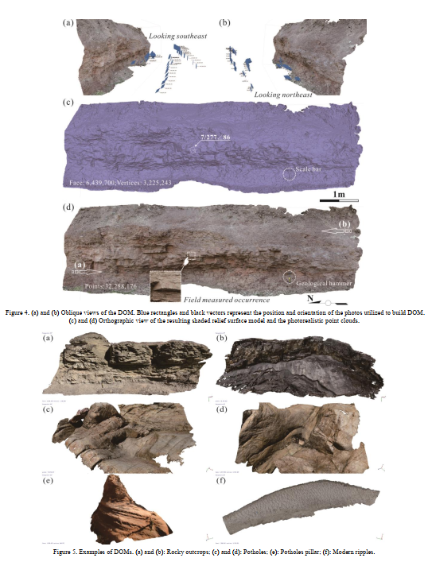

Digital Outcrop Models (DOMs) are becoming increasingly attractive tools in geoscientific fields. Light Detection and Ranging (LiDAR) is the most common used technology to create such 3D models recently, but not applicable for the fieldwork in current geological survey because of their high cost and weight. Fortunately, the advent of Structure-from-Motion (SfM) provides a low-cost but effective method for creating virtual 3-D outcrops. This study presents a routine and effective workflow of using SfM method to create a reliable and accurate DOM from field survey to model reconstruction based on Agisoft PhotoScan, and summarized the requirements and considerations of each step in detail, including preliminary preparations, ground control points and photo collection path in field surveys, as well as photos quality inspection, aligning photos, building dense point clouds and georeferencing model in SfM model creation. This systematic procedure can lay a solid foundation for subsequent geological information extraction.

