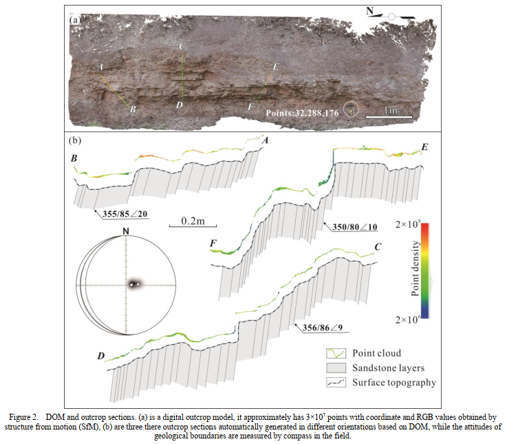

Geological section measurement is a necessary task for regional geological survey. Traditional method using tapeline together with compass has many limitations such as multiple manual measurements along different orientation across different structures, visual conditions, tapeline bending, manual measurement error and second projection defects. Point coordinates method recently established have allowed us to use points with X, Y, Z values to obtain terrain control profiles. However, it is difficult to adequately reveal the spatial and tectonic characteristics of outcrops in arbitrary orientation using sparse GPS coordinates. In order to obtain more realistic geological structural features, this paper propose a new section measurement method that utilizes high-density point cloud data with X, Y, Z values obtained by LiDAR and high-resolution digital images with RGB values. Based on digital image processing technology, the high-resolution digital images are fused with the high-density point cloud data. And then, a digital outcrop model (DOM) is generated, which contains spatial coordinate information, RGB values of any points of outcrops and surface morphological features in a 3D space. Finally, a geological section in arbitrary orientations can be generated efficiently and quickly under the point coordinate method after the DOM ortho-projected. Because the spatial resolution of point cloud data reaches millimeter scale, the outcrop section parameters extracted by this approach, such as fault displacement, stratum thickness, are more precise than manual measurements (generally only meter scale). Furthermore, LiDAR and photogrammetry are both non-contact measurement technologies, which greatly reduce the potential risk of geologists in the field environments like cliff.

