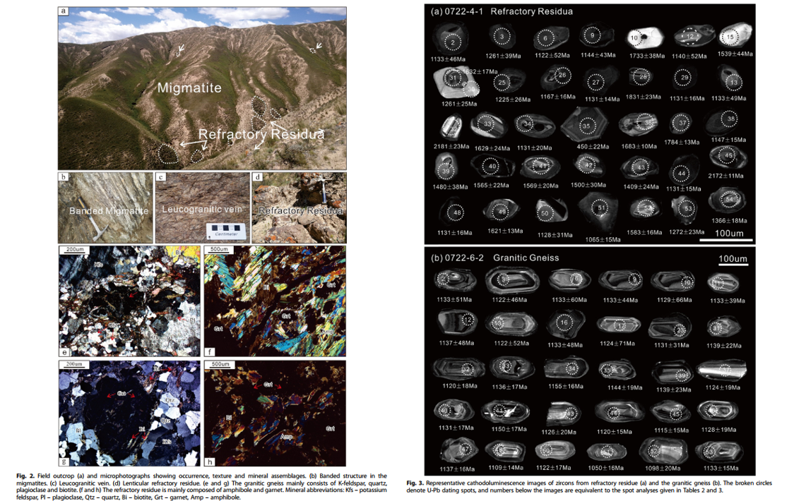

Detailed petrologic, geochemical and geochronological investigation on migmatites provide key information on the tectonic-magmatic history of the Quanji Massif, NW China. The studied migmatites are mainly composed of granitic gneisses, with lenticular refractory residua spread along its foliation. Zircon U-Pb ages of 1129.2 ± 7.4 Ma (1σ, MSWD = 0.34, N = 31) and 1135.1 ± 9.5 Ma (1σ, MSWD = 0.05, N = 22) were determined for the granitic gneiss and refractory residue, respectively. Garnet grains from the refractory residue show no distinctive intra-crystalline zonation, and are rich in Fe and Mg, but poor in Ca and Mn, akin to those from metapelite. Samples from the granitic gneisses have high contents of Si02 (from 67.92% to 69.89%), K2O (from 3.94% to 5.00%) and A/CNK (1.11-1.17), with LREE enrichment and distinctly negative Eu anomalies (Eu/Eu* = 0.49-0.53) in the chon-drite-normalized REE patterns, and significantly negative Nb, Ta, Ti and Sr anomalies in the primitive mantle-normalized spider diagrams. Granitic gneisses samples have consistent Nd isotope compositions with negative εNd(t) values ranging from -1.06 to -6.04, and TDM model ages ranging from 1.83 to 2.23 Ga. These geochemical features suggest that the granitic rocks belong to the S-type granites, which were predominately derived from a late Paleoproterozoic crustal source. The granitic gneiss was probably formed by partial melting of the sediments which had been suffered graunlite-facies metamorphism. The components with low melting points (e.g., felsic minerals) might replace the sediments to form migmatites and migmatitic granites, and thus preserved the refractory residua. Therefore, the late Mesoproterozoic orogenic event is the coeval response of the global Grenvillian orogeny, indicating an important crustal remelting episode in the Quanji Massif.

