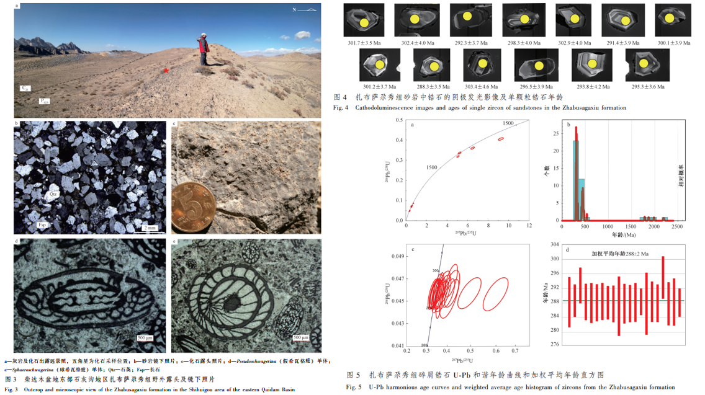

The Carboniferous hydrocarbon exploration in the Qaidam Basin, Qinghai province in northern China, is the focus in the investigation of newly developed area and new series of strata. The Carboniferous sedimentary strata are fully exposed in the eastern part of the Qaidam Basin, and it has been assumed that there are no sedimentary strata of Permian. Nowadays, it is still controversial whether the Zhabusagaxiu formation belongs to the Carboniferous or Permian. In this paper, detrital zircons from sandstones of the Zhabusagaxiu formation were collected and the zircon U-Pb LA-ICP-MS isotopic dating was carried out. The harmonious ages of zircons were obtained, ranging from 2488±34 Ma to 288±3 Ma. The weighted average age of the youngest group is 288.0±2.0 Ma (MSWD=0.112, n=21). This means that the deposition of sandstones in the Zhabusagaxiu formation happened after 288 Ma, later than the international Carboniferous-Permian boundary (299 Ma). Based on the field investigation and previous research, there are abundant fossil families of Fusulina in the Zhabusagaxiu formation, and especially the appearance of pseudoschwagerina or spyroschwagerina is a crucial sign of entering the Permian. Consequently, combined with the zircon geochronology of classic rocks and typical fossil characteristics in the strata, it is suggested that the Zhabusagaxiu formation should belong to the Early Permian, indicating the existence of Permian stratigraphic deposition in the eastern Qaidam Basin. This recognition provides a geological basis for deepening the sedimentary formation and structural evolution from the late Paleozoic to Mesozoic in the Qaidam Basin.

