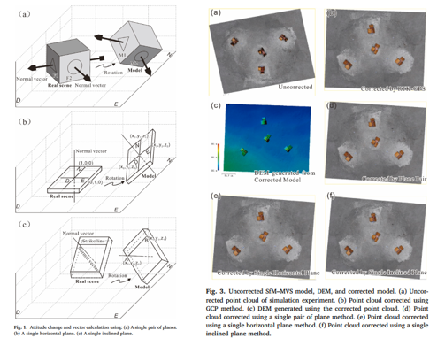

Structure-from-Motion/Multiview Stereo (SfM-MVS) point cloud has the potential to display objects and to generate corresponding digital elevation model (DEM) and orthomosaic, from which geometric parameters such as the orientations, shapes, and sizes can be derived, thus making it a promising tool for structural geology. High-precision coordinates of ground control points (GCP) are commonly used for SfM-MVS point cloud correction, but the coordinate measurement depends on expensive and heavy equipment, and more importantly, there is uncertainty of the Global Position System (GPS) signal in some environments. A potential alternative correction method is to use orientations from outcrops, although this method still requires further optimization. This study aims to improve this orientation-based method using ground control planes (GCPL) and test its effectiveness through geometric analysis and simulation experiments, and the improved schemes are as follows: using a single pair of nonparallel planes, using a single horizontal plane with linear orientation marks, and using a single inclined plane with a strike mark. The GCPL method requires a few orientations, and its accuracy is sufficient for fieldwork. It greatly simplifies the field investigation and improves the applicability of SfM–MVS in environments with unavailable GPS signals or with rigid body rotations for GPS imprecision.

