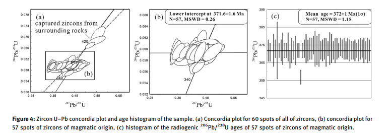

The timing of Barleik Formation in Xinjiang, NW China, has not been constrained by accurate geochronology yet, while this work is of great significance to help reconstruct the geological tectonic evolution of Western Junggar. Based on the LA-ICP-MS U–Pb geochronology study, the weighted average age of magmatic zircons collected from the tuff in Barleik Formation, which reflects the formation age of the tuff, is 372 ± 2 Ma (N = 57, mean square of weighted deviates (MSWD) = 1.15). The first report in this study of the zircon U–Pb dating result indicates that Barleik Formation along the West Junggar tectonic belt occurred in the Late Devonian rather than in the middle Devonian period as previously claimed. Meanwhile, chronology data and the geochemical features comparing with the Island Arc-related rocks in the adjacent area, as well as stratigraphic structural relationship, suggest that volcanic activities may exist in the Late Devonian, and the relevant volcanic ash deposited in the Barleik forearc basin may be derived from the adjacent island arc (current geographic coordinate). In addition, the fossil assemblage dominated by bathyal-abyssal invertebrate fossils and bathyal-abyssal facies indicates that the Barleik Formation is a bathyal-abyssal sedimentary environment.

