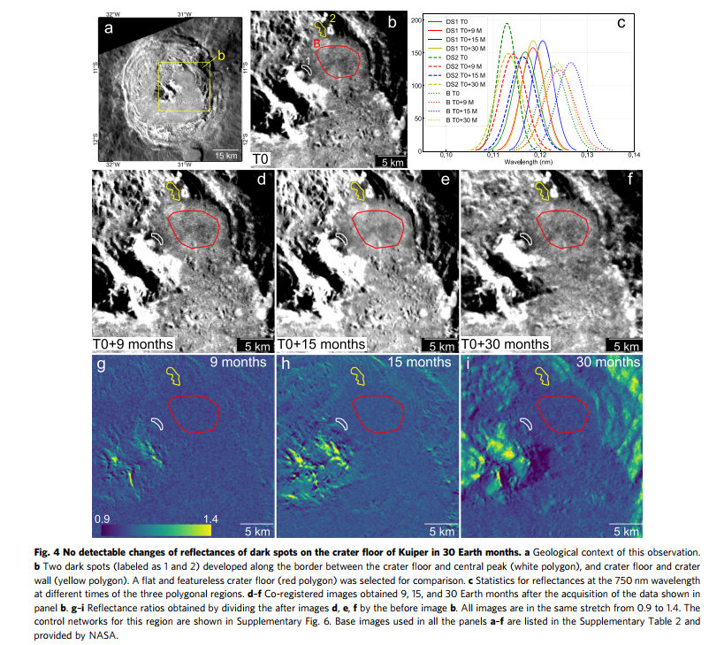

Dark spots on Mercury are recently-formed thin and low-reflectance materials that are related with volatile activity and supposed to be much shorter-lived than their central hollows. Containing unique information about the possible building blocks of Mercury, dark spots have unresolved darkening phases, formation mechanism, and lifetime. Here we investigated reflectance spectra, sub-resolution roughness, and temporal changes of dark spots using the full-mission dataset of MESSENGER. We find that dark spots have the highest concentration of graphite and an intense outgassing origin. Temporal imaging for dark spots reveals no detectable reflectance changes in 30 Earth months, and possibly over 40 Earth years. These observations demonstrate that thermally unstable sulfides such as MgS and CaS are not the major components in dark spots. Possible reflectance changes of dark spots may occur at much longer time scales, providing a reference for modeling the spectral behavior of graphite caused by space weathering on Mercury.

