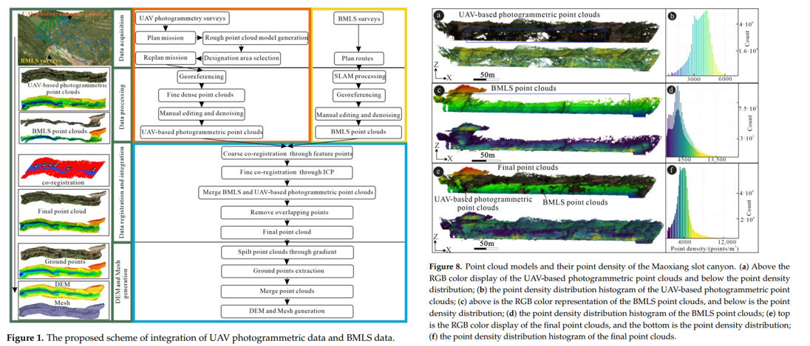

Accurate terrain models are critical for studying the formation and development of slot canyons. However, for slot canyon landforms, it is challenging to generate comprehensive and high-resolution morphological data by individual observation due to the inaccessibility of steep walls on either side and the complexity of the field observation environment, such as variable-slope terrain, partial vegetation cover, and lack of satellite signal. Off-the-shelf surveying techniques, including Unmanned Aerial Vehicles (UAV) photogrammetry and Backpack Mobile Laser Scanning (BMLS), facilitate slot canyon surveys and provide better observations. This paper proposes an integrated scheme to generate comprehensive and centimeter-resolution slot canyon terrain datasets (e.g., color point clouds, Digital Elevation Models (DEM), and 3D mesh) using BMLS and fine UAV photogrammetry. The results show that the fine flight of UAVs based on a rough model can avoid collision with obstacles or flying into restricted areas, allowing users to perform tasks faster and safer. Data integration of BMLS and UAV photogrammetry can obtain accurate terrain datasets with a Root Mean Squared Error (RMSE) of point cloud registration of 0.028 m. Such high-resolution integration terrain datasets reduce local data shadows produced solely by individual datasets, providing a starting point to revealing morphological evolution and genesis of slot canyons.

