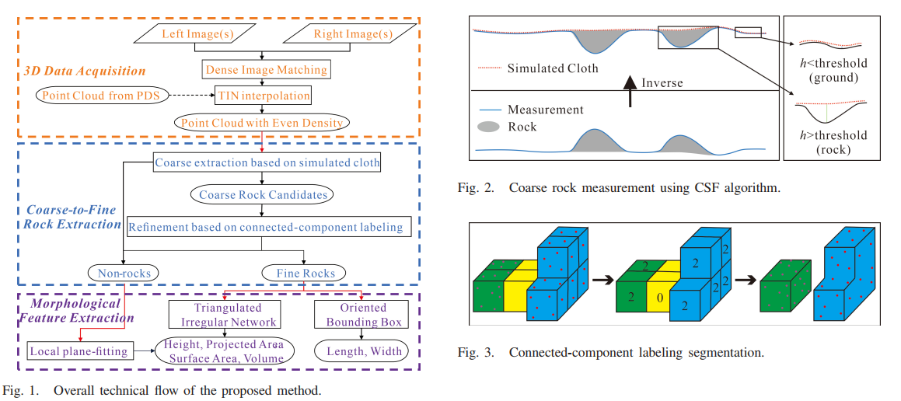

Fine-scale 3-D morphological features of rocks on the Martian surface provide important clues to Mars exploration missions and scientific discoveries. To obtain such information, an automatic approach for high-precision measurement of 3-D morphological features of Martian rocks is proposed in this letter. The approach directly detects 3-D rocks from dense point cloud that is generated by interpolating triangulated irregular network (TIN) model, through a coarse-to-fine process combining cloth simulation filtering (CSF) and connected-component labeling algorithms. Multiple 3-D morphological features are then precisely extracted by modeling rock points and fitting local ground plane. Experimental results demonstrate that the proposed approach provides an effective way for the extraction of complete 3-D rocks and comprehensive morphological features with over 90% accuracy.

