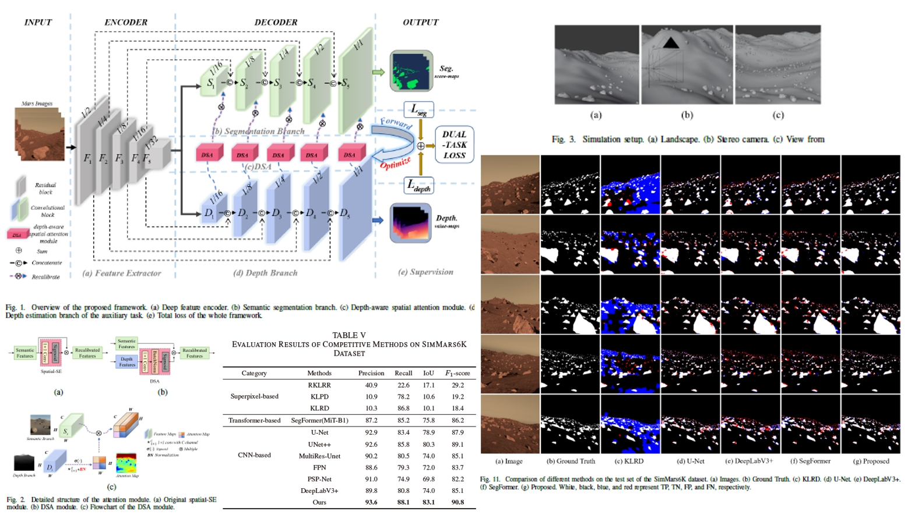

Extracting rocks from Mars rover images using convolutional neural networks is a semantic segmentation problem gaining increasing attention in planetary science and artificial intelligence. However, this task still faces the challenges of inaccurate extraction of rock boundaries and small rocks. An important reason is that the textural features of the Mars rover images are not discriminative enough between the target and the background. In order to obtain 3-D information to enhance the rock extraction without introducing additional data, we designed a dual-task branch network with a Y-shaped encoder-decoder structure. In our network, the primary semantic segmentation task branch is used to decode textural features into semantic features and output rock extraction results; the auxiliary task depth estimation branch decodes textural features into depth features in 3-D, and transmits them to the primary branch through the spatial attention module to enhance the identification ability of semantic features for boundaries and small targets. In addition, another reason impedes accurate Mars rock extraction is the lack of high-quality annotated training datasets. Therefore, we created a dataset containing 6,325 images pairs with corresponding annotations and depth information, SimMars6K. Ablation and comparison experiments based on this dataset and two actual datasets show that our method achieves 83.1% IoU and 90.8 F1-score on simulated dataset, and outperforms other methods on actual datasets with 2% improvement in recall. Transfer learning experiment shows that the pre-training on our simulated data can bring up to additional 5% gain on mIoU and 6% gain on mPA for general model.

