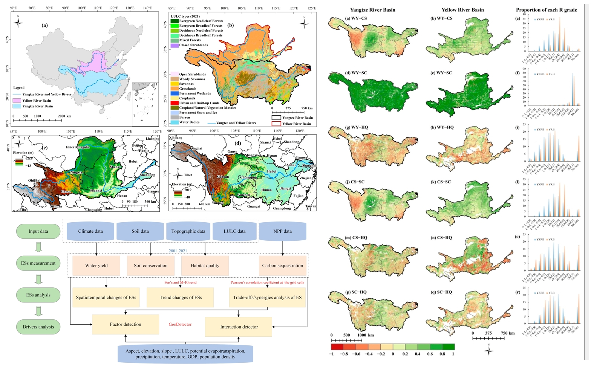

The Yangtze River Basin (YZRB) and the Yellow River Basin (YRB), which are crucial for ecology and economy in China, face growing challenges to ecosystem service (ES) functions due to global population growth, urbanization, and climate change. This study assessed the spatiotemporal dynamics of ESs in the YZRB and the YRB between 2001 and 2021, comprehensively encompassing essential aspects such as water yield (WY), carbon sequestration (CS), soil conservation (SC), and habitat quality (HQ) while also analyzing the trade-offs and synergies among these ESs at the grid cells. The GeoDetector was employed to ascertain individual or interactive effects of natural and anthropogenic factors on these ESs and their trade-offs/synergies. The results showed that (1) from 2001 to 2021, the four ESs exhibited significant spatial disparities in the distribution within two basins, with the overall trend of ESs mainly increasing. YZRB consistently exhibited substantially higher ES values than the YRB. (2) Complex trade-offs and synergies among these ESs were apparent in both basins, characterized by distinct spatial heterogeneity. The spatial relationships of WY–CS, WY–SC, CS–SC, and CS–HQ were mainly synergistic. (3) Precipitation, potential evapotranspiration, elevation, land use and land cover (LULC), and slope influenced ESs in both basins. Notably, interactive factors, particularly the interactions involving LULC and other factors, demonstrated more robust explanatory power for ESs and their trade-offs/synergies than individual drivers. These findings significantly affect the refined ecosystem management and sustainable development decision-making in large rivers or regions.

