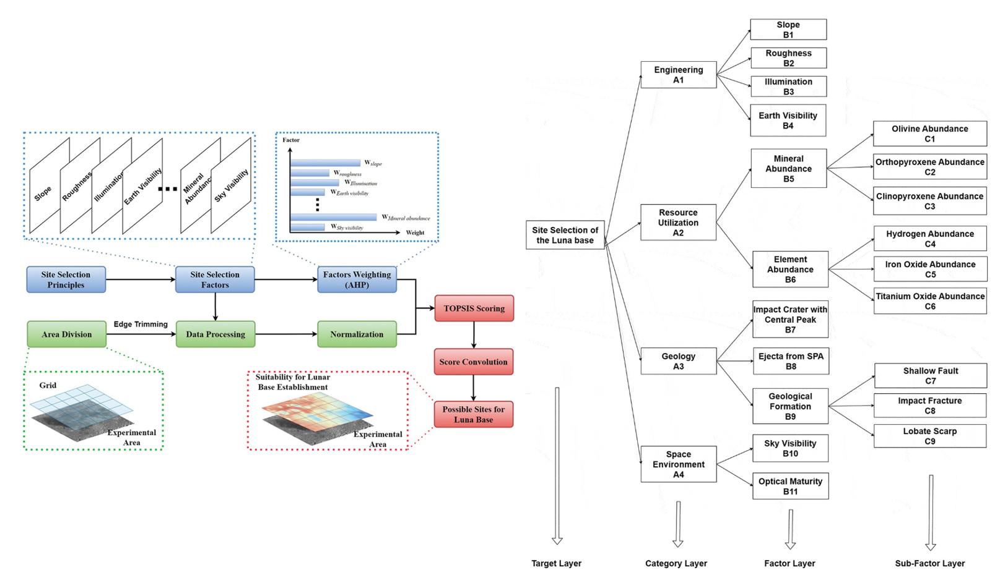

Countries are now shifting from one-off lunar exploration missions to the establishment of a lunar base for long-term sustainable surveys. The selection of a suitable site plays a crucial role in sustaining the base’s operation and facilitating scientific research. Previous site selection methods have been limited in their ability to consider multiple objectives and factors simultaneously, often relying heavily on expert knowledge. To address this challenge, this paper proposes a comprehensive site selection method that integrates multiple engineering and scientific objectives/factors. Through site selection factor comprehending, gridded data processing and site evaluation based on Technique for Order of Preference by Similarity to Ideal Solution (TOPSIS), the proposed method balances subjective and objective considerations and outputs quantitative descriptions of the most suitable candidate sites. This paper applies the proposed method to the range of 75°S  −  90°S. The results reveal four large areas with continuous high suitability near the South Pole, while a small area located at the rim of Cabeus B crater shows the highest suitability. Qualitative and quantitative comparisons are conducted between the areas selected by the proposed method, areas recommended by previous studies, and areas announced by Artemis III. The candidate areas identified in this paper outperform others in terms of a wider range of site selection factors, making them valuable references for future lunar base site determination. Additionally, the proposed site selection method holds relevance for similar site selection tasks where multiple objectives are set. It offers a more automated and quantifiable approach, minimizing manual intervention and providing robust results for decision-making processes.

