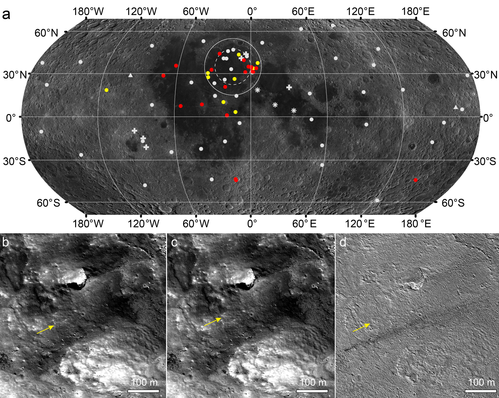

Mass wasting of slope materials is a fundamental surface process on the Moon, yet its current activity and geohazard risks remain unconstrained. Here we analyze multi-temporal images for terrains representing the least stable areas on the Moon, revealing new landslides formed in the past 15 years. The new landslides are superficial and small in sizes, displacing materials much less than 105 m3 in volumes. With localized occurrences, new landslides may pose limited hazards to future surface explorations, except for slope-proximal facilities and operations. Without clear genetic relation with thermal weathering of exposed crystalline rocks, about 29% of the new landslides were likely triggered by new impact events, but the efficiency is comparatively small than that of endogenic seismic activity. Most new landslides were likely induced by endogenic moonquakes, and they display distinct spatial clustering in the east of Imbrium basin, implying heterogeneous distributions of seismic zones in the lunar interior..

