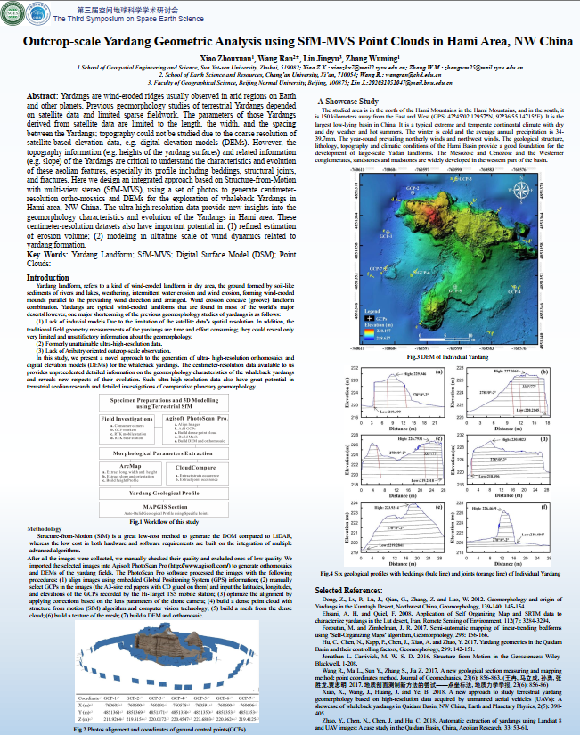

Yardangs are wind-eroded ridges usually observed in arid regions on Earth and other planets. Previous geomorphology studies of terrestrial Yardangs depended on satellite data and limited sparse fieldwork. Here we design an integrated approach based on Structure-from-Motion with multi-view stereo (SfM-MVS), using a set of photos to generate centimeter-resolution ortho-mosaics and DEMs for the exploration of whaleback Yardangs in Hami area, NW China.

