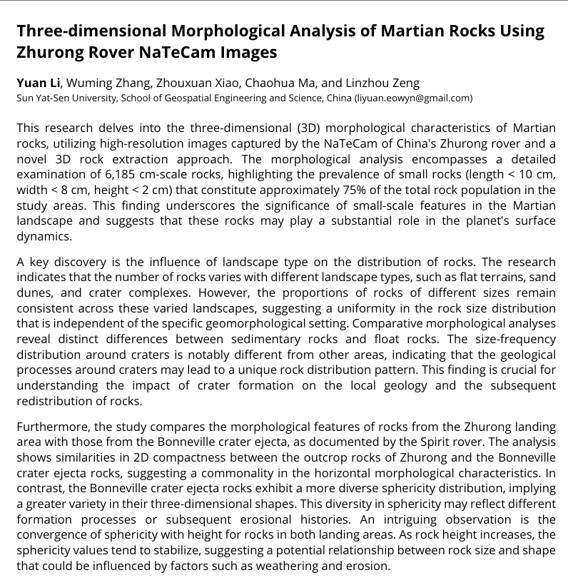

This research delves into the three-dimensional (3D) morphological characteristics of Martian rocks, utilizing high-resolution images captured by the NaTeCam of China's Zhurong rover and a novel 3D rock extraction approach. The morphological analysis encompasses a detailed examination of 6,185 cm-scale rocks, highlighting the prevalence of small rocks (length < 10 cm, width < 8 cm, height < 2 cm) that constitute approximately 75% of the total rock population in the study areas. This finding underscores the significance of small-scale features in the Martian landscape and suggests that these rocks may play a substantial role in the planet's surface dynamics.

A key discovery is the influence of landscape type on the distribution of rocks. The research indicates that the number of rocks varies with different landscape types, such as flat terrains, sand dunes, and crater complexes. However, the proportions of rocks of different sizes remain consistent across these varied landscapes, suggesting a uniformity in the rock size distribution that is independent of the specific geomorphological setting. Comparative morphological analyses reveal distinct differences between sedimentary rocks and float rocks. The size-frequency distribution around craters is notably different from other areas, indicating that the geological processes around craters may lead to a unique rock distribution pattern. This finding is crucial for understanding the impact of crater formation on the local geology and the subsequent redistribution of rocks.

Furthermore, the study compares the morphological features of rocks from the Zhurong landing area with those from the Bonneville crater ejecta, as documented by the Spirit rover. The analysis shows similarities in 2D compactness between the outcrop rocks of Zhurong and the Bonneville crater ejecta rocks, suggesting a commonality in the horizontal morphological characteristics. In contrast, the Bonneville crater ejecta rocks exhibit a more diverse sphericity distribution, implying a greater variety in their three-dimensional shapes. This diversity in sphericity may reflect different formation processes or subsequent erosional histories. An intriguing observation is the convergence of sphericity with height for rocks in both landing areas. As rock height increases, the sphericity values tend to stabilize, suggesting a potential relationship between rock size and shape that could be influenced by factors such as weathering and erosion.

In conclusion, this study provides a detailed and nuanced understanding of the 3D morphological features of Martian rocks. The findings not only contribute to the broader knowledge of Martian geology but also offer specific insights into the geological processes that have shaped the Martian surface over time. The analysis of cm-scale rocks, in particular, reveals the complexity and diversity of the Martian landscape, highlighting the importance of small-scale features in the overall geological picture. These results are expected to inform future Martian exploration missions and enhance our understanding of the planet's geological evolution.

